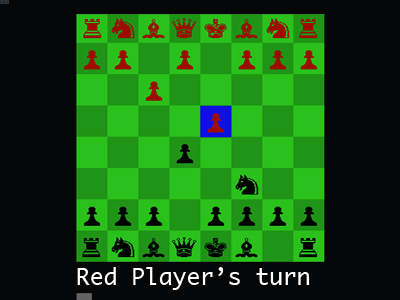

# Chess

## A 2d console game built with Ruby

- [ ] Make sure Ruby is installed on your system.
- [ ] Install the 'Colorize' gem on your system in order to use: 'gem install colorize'
- [ ] Download this project directory and cd to its location on your cpu: chess/ruby
- [ ] Run the display file in terminal to start the game: 'ruby display.rb'

## Features

- [ ] Implements Class Inheritance to stagger abilities for multiple types chess pieces.
- [ ] Validates moves based on a piece's own knowledge of its surroundings.
